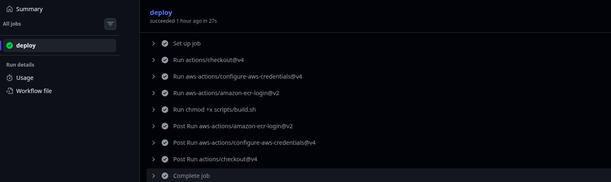
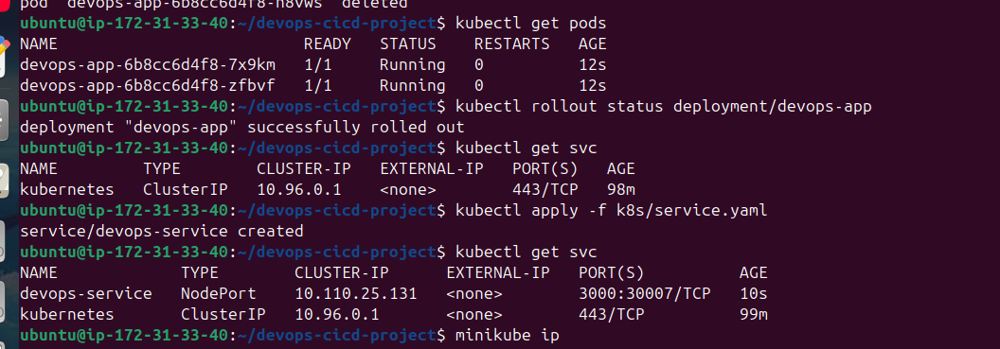
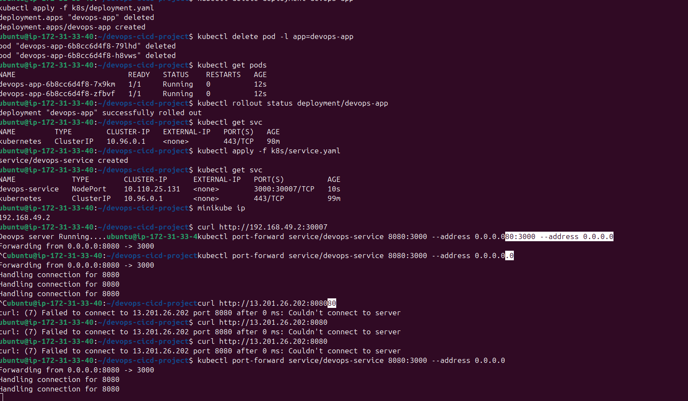

# Cloud-Native CI/CD Pipeline using Docker, Kubernetes & AWS

## Overview
This project demonstrates a **semi-automated CI/CD pipeline** where application builds are automated using GitHub Actions, and deployments are performed on a Kubernetes cluster running on AWS EC2 using Minikube. Docker is used for containerization, and AWS Elastic Container Registry (ECR) is used as a private image registry.

The project focuses on core DevOps practices such as CI automation, containerization, Kubernetes deployment, and secure image pulls from a private registry.

---

## Technologies Used
- Node Application
- Docker  
- Kubernetes (Minikube)  
- AWS EC2  
- AWS ECR  
- Git & GitHub  
- GitHub Actions  
- Bash  
- Linux  

---

## Project Architecture
1. Developer pushes code to GitHub  
2. GitHub Actions triggers the CI pipeline  
3. Docker image is built automatically  
4. Image is pushed to AWS ECR  
5. Kubernetes cluster on AWS EC2 pulls the image from ECR  
6. Application is deployed using Kubernetes Deployment and Service  

---

## CI/CD Workflow

### Continuous Integration (CI)
- GitHub Actions is used to automate the build process.
- Docker images are built on every push to the main branch.
- Built images are securely pushed to AWS ECR.

### Continuous Deployment (CD)
- Kubernetes (Minikube) runs on an AWS EC2 instance.
- Deployment and Service manifests manage application pods and networking.
- Kubernetes pulls images from a private ECR repository using imagePullSecrets.

---

## Kubernetes Components
- **Deployment**  
  Manages application pods, replica count, and ensures high availability.

- **Service (NodePort)**  
  Exposes the application within the cluster.

- **imagePullSecrets**  
  Allows Kubernetes to authenticate with a private AWS ECR registry.

##  Screenshots

### CI Pipeline (GitHub Actions)
 (screenshots/github-actions-02.png)

### Kubernetes Pods Running

### Application Running
 (screenshots/application-output-02.png)

## Key Learnings

1. Built an automated CI pipeline using GitHub Actions.  
2. Containerized applications using Docker.  
3. Worked with private container registries using AWS ECR.  
4. Deployed and managed applications using Kubernetes.  
5. Configured imagePullSecrets for secure image pulls.  
6. Gained hands-on experience with Kubernetes networking and rollouts.  
7. Used cost-effective cloud practices with Minikube on AWS EC2.  

## Project Status

The application was successfully deployed and tested on AWS EC2.  
The infrastructure was terminated after validation to avoid unnecessary cloud costs.

---

## Author

**Balu Patil**

